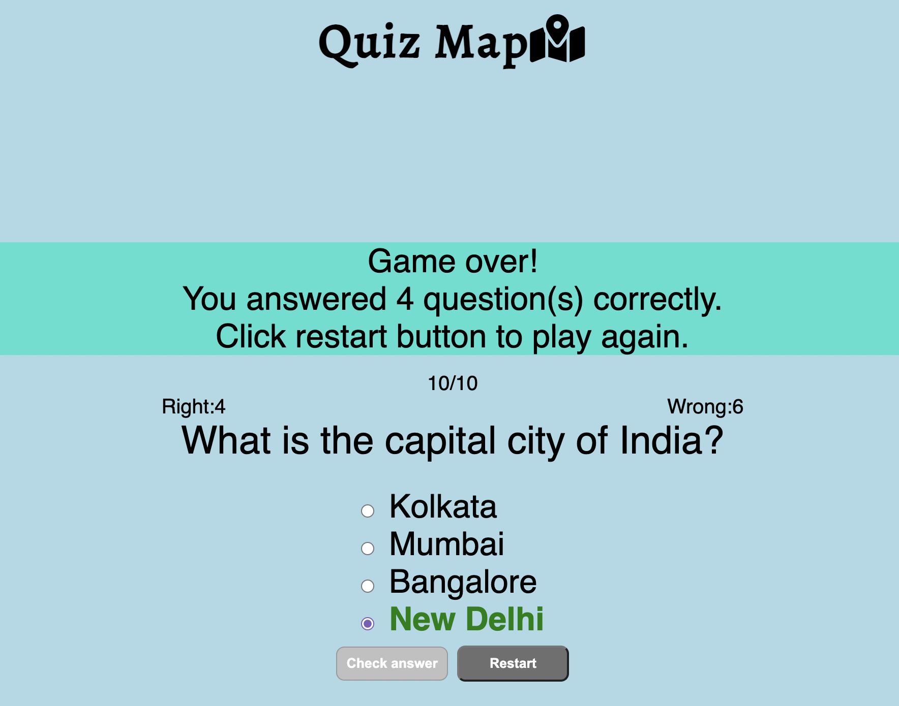

# Quiz World
Quiz world is a multiple choice quiz on capital cities of the world. The quiz aims to give an interactive, educational and fun game experience for users aged 10+ to test and expand their knowledge of the world's capital cities. At the end of the game users will get a score and option to play again. View the live site [here](https://nataliatesarova.github.io/quiz/).

<!--- ADD MULTIPLE DEVICE IMAGES -->

## Features 
### Favicon logo
* A favicon of planet earth is incorporated to aid branding of the quiz and also enables users to more easily locate the page when multiple tabs are open.

### Heading
The Quiz Map title followed by a location on map logo clearly coveys the subject material of the quiz to the user.

### Start quiz overlay
* A colorful map incorporarting the flags of the world followed by the statement 'Let's practice capital cities' clearly conveys the fun educational intention of the quiz and prompts the user to click the start button. The start button changes color from grey to blue when the cursor is hovered over. The welcome title and start button are presented in an overlay screen which disappears on pressing the start button which is then followed with the first quiz question.

### Question and Answers
* Ten questions was included in the quiz, a number intended to be mangageable by all users. Each of the questions are followed by 4 answer choices which can be chosen by clicking a radio button. 

<!--- ADD IMAGE OF first question and answer slide???-->

* Only when an answer is selected is it possible to click on the check answer button leading to highlighting in green or red if the answer is correct or incorrect respectively. The check answer button is then disabled turning from dark grey to light grey in color, and the next button becomes enabled. Once an answer is selected and check answer button clicked it is not possible to change the answer choice. 

* On clicking the next button the counters of question number, and number of right and wrong answers are updated. The check answer and next button also incorporate a hover color change feature.
<!--- ADD IMAGE OF second question with counters changing-->

*The next button disappears on the last question.
<!--- ADD IMAGE OF question 10-->

* Final game over page gives score summary and restart button appears to give user option to try quiz again.
<!--- ADD IMAGE OF summary page-->

### Features left to implement
* A possible future enhancement would be to add: 
* Game timer.
* Addition of more question topics such as rivers of the world and identifying images of flags of the world.
* Randomised questions.
* Varying final summary page with animation depending on how well the user scored e.g. champagne cork exploding if 10/10 correct answers.

### Accesibility
* Use of semantic HTML.
* Use of alt attributes to provide alternative information for users.
* Use of Adobe Color to check colour contrast.
* Color contrasts meet the standards specified in [WCAG 2.1 contrast guidelines](https://www.w3.org/WAI/WCAG21/Understanding/contrast-minimum.html).

##  Design
### Color scheme
The color scheme is as follows:
* Main background - light blue RGB (173,216,230).
* Overlay background - purple RGB (124, 94, 186).  
* Game summary background - cyan RGB (64, 224, 208).
* Main font - black RGB (0,0,0).
* Overlay font - white RGB (255, 255, 255).
* Correct answer - green RGB (0,128,0).
* Incorrect answer - red RGB (255,0,0). 
* Button color - grey RGB (111, 111, 111).
* Button hover - blue RGB (100, 149, 237).
* Disabled button - silver RGB (192, 192, 192).
* Button text - white RGB (255,255,255).

### Typography
* Alegreya font from Google fonts.
* Sans-serif.

### Logo
The logo was obtained from [Font Awesome](https://fontawesome.com/).

<!--- ADD IMAGE OF logo-->

### Images
The world flag map image was obtained from [Stock Vault](https://www.stockvault.net/photo/157915/world-flag-map).

## Wireframes
Overlay

Main page 

