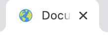

# Quiz World
Quiz world is a multiple choice quiz on capital cities of the world. The quiz aims to give an interactive, educational and fun game experience for users aged 9+ to test and expand their knowledge of the world's capital cities. At the end of the game users will get a score and option to play again. View the live site [here](https://nataliatesarova.github.io/quiz/).


## Features 
### Favicon logo
* A favicon of planet earth is incorporated to aid branding of the quiz and also enables users to more easily locate the page when multiple tabs are open.



### Heading and logo
The Quiz Map title followed by a location-on-map logo clearly coveys the subject material of the quiz to the user.


### Start quiz overlay
* The start quiz overlay incorporates a colorful map with the flags of the world followed by the statement 'Let's practice capital cities' and a start button. The overlay signals the fun educational intention of the quiz and prompts the user to click the start button. The start button changes color from grey to blue when the cursor is hovered over. On pressing the start button the overlay disappears and the first question is presented.


### Question and answers
* Ten questions were included in the quiz, a number intended to be mangageable for users. Each of the questions are followed by a choice of 4 answers which can be chosen by clicking a radio button. 


* Only when an answer is selected is it possible to click on the check answer button leading to highlighting in green or red if the answer is correct or incorrect respectively. The check answer button is then disabled turning from dark grey to light grey in color, and the next button becomes enabled. Once an answer is selected and check answer button clicked it is not possible to change the answer choice. 


* On clicking the next button the counters of question number, and number of right and wrong answers are updated. The check answer and next button also incorporate a hover color change feature.


* The next button disappears on the last question.


* The game over page provides the score summary with a restart button giving the user the option to try again.


### Features left to implement
Possible future enhancements would be to add: 
* Game timer.
* Addition of more question topics such as rivers, mountains, beaches and flags of the world.
* Randomised questions.
* Varying final summary page with animation depending on how well the user scored e.g. champagne cork exploding if 10/10 correct answers.

### Accesibility
* Use of semantic HTML.
* Use of alt attribute to provide alternative information for users that cannot see the image, such as those relying on screen readers.
* Use of Adobe Color to check colour contrast.
* Color contrasts meet the standards specified in [WCAG 2.1 contrast guidelines](https://www.w3.org/WAI/WCAG21/Understanding/contrast-minimum.html).

##  Design
### Color scheme
* Main background - light blue RGB (173,216,230).
* Overlay background - purple RGB (124, 94, 186).  
* Game summary background - cyan RGB (64, 224, 208).
* Main font - black RGB (0,0,0).
* Overlay font - white RGB (255, 255, 255).
* Correct answer - green RGB (0,128,0).
* Incorrect answer - red RGB (255,0,0). 
* Button color - grey RGB (111, 111, 111).
* Button hover - blue RGB (100, 149, 237).
* Disabled button - silver RGB (192, 192, 192).
* Button text - white RGB (255,255,255).

### Typography
* Alegreya font from Google fonts.
* Sans-serif.

### Logo
The logo was obtained from [Font Awesome](https://fontawesome.com/).


### Images
The world flag map image was obtained from [Stock Vault](https://www.stockvault.net/photo/157915/world-flag-map).


### Balsamiq frameworks
Overlay


Main page 


## Testing
### Responsiveness
* All pages were tested and found to be responsive using [TechSini Multi device Website Mockup Generator](https://techsini.com/multi-mockup/) and Google Chrome DevTools. The website was tested on Google Chrome, Safari, Microsoft Edge and Opera browsers with iPhone SE, iPhone 14 Pro, iPhone 14 Pro Max, Samsung Galaxy S8+, Ipad Air devices. Pass.

### Validator
* HTML: No errors were found when passing through the W3C validator at the final check.

* CSS: No errors were found when passing through the Jigsaw validator at the final check.

* JS: No errors were found when passing through the JSHint code analysis tool at the final check.

### Accessibility
* Adobe Color was used to test contrast for accessibility. 


* Lighthouse in the Chrome Developer Tools was used to test website performance, accessibility, and adherance to best practices and search engine optimization (SEO) advice. 


### Bugs
* HTML Validator detected the error of double writing the word 'type' in the code for the start button. This was solved by deleting the word.
* Game over was not displaying on smaller devices which was fixed by adding margin-top in media queries.

### Manual testing
Logo and text
  - Confirm that the logo and text fonts were loaded, and were responsive to different screen sizes. Pass.

Overlay and image
- Check the overlay and map flag image was loaded correctly and was responsive to different screen sizes. Pass.
- Clicking start button causes overlay screen to disappear and quiz initiation. Pass.

Quiz
- Radio buttons highlight when clicked. Pass.
- Hover feature on check answer button and next button function. Pass.
- Check answer button can only be clicked if radio button clicked first. Pass.
- Once clicked the check answer button changes color to light grey and becomes disabled, and the chosen answer is highlighted in green or red if correct or incorrect respectively. Pass.
- The next button becomes enabled only after check answer button clicked. Pass.
- On clicking next button the subsequent question and answers are displayed. Pass.
- Next button dissapears on final question. Pass.
- On clicking check answer button on final question the game over summary score page is displayed. Pass.

## Technologies used
### Languages
* HyperText Markup language (HTML) - the standard markup language for documents designed to be displayed in a web browser.
* Cascading Style Sheets (CSS) - used to describe the presentation of the document written in HTML.
* JavaScript (JS) - used to add interactivity and dynamic functionality to web pages.

### Frameworks, Libraries and Programs
* [Balsamiq](https://balsamiq.com/wireframes/)- used to create the wireframes.
* [Github](https://github.com/) - cloud based hosting service to save and store the files for webite.
* Git - version control system.
* [Visual Studio Code](https://code.visualstudio.com/) - the website was created using Microsoft Visual Studio Code integrated development environment (IDE).
* [Favicon Generator](https://www.favicon-generator.org/) -used to incorporate the website favicon
* [Font Awesome](https://fontawesome.com/) - font and icon toolkit.
* [Google Fonts](https://fonts.google.com/about) - used to importing the fonts on the website.
* [Google Chrome DevTools](https://developer.chrome.com/docs/devtools/) - used for troubleshooting and testing features, and to solve issues with responsiveness and styling.
* [Multi Device Website Mockup Generator](https://techsini.com/multi-mockup/) - used to show website on range of devices.

## Deployment
### Version control
The site was created using Visual Studio Code editor (Microsoft) and pushed to github to the remote repository ‘ADD NAME’.

The following git commands were used to push code to the remote repository:

```git add <file>``` - This command added the file(s) to the staging area before they are committed.

```git commit -m “commit message”``` - This command allowed the commit of changes to the local repository queue.

```git push``` - This command pushed all committed code to the remote repository on github.

### Deployment to Github Pages
* The site was deployed to GitHub pages. Deployment requires the following steps: 
  - In the GitHub repository, navigate to the Settings tab 
  - From the menu on left select 'Pages'
  - From the source section drop-down menu, select the Branch: main
  - Click 'Save'
  - A link will be displayed in a green banner when published successfully. The link is available [here](https://github.com/nataliatesarova/quiz)

### How to Clone 
* To clone a repository from GitHub to your local machine.
  - In the GitHub repository click the Code button above the repository files.
  - Copy the URL for the repository and choose either: HTTP, SSH or GitHub CLI.
  - Open your terminal and change the current working directory to the location where you would like the cloned directory.
  - Type ```git clone```, paste the URL copied earlier and press enter.

## Credits
I would like to thank my mentor Rory Sheridan and all the tutors, teachers and student colleagues for help and advice on the project. 

### Content and media
Instructions on how to use the forEach loop method was provided by [free code camp](https://www.freecodecamp.org/newsjavascript-foreach-how-to-loop-through-an-array-in-js/)

Instructions on button enabling and disabling was provided by [W3 schools](https://www.w3schools.com/jsref/prop_pushbutton_disabled.asp#:~:text=The%20disabled%20property%20sets%20or,reflects%20the%20HTML%20disabled%20attribute)

The website favicon was provided by [Icons8](https://icons8.com/icons/set/favicon)

The website logo was provided by [Font Awesome](https://fontawesome.com/)

The world map image on the layout page was provided by [stockvault](https://www.stockvault.net/photo/157915/world-flag-map). 

The images and icons are used for educational purposes and there were no known copyright issues.


